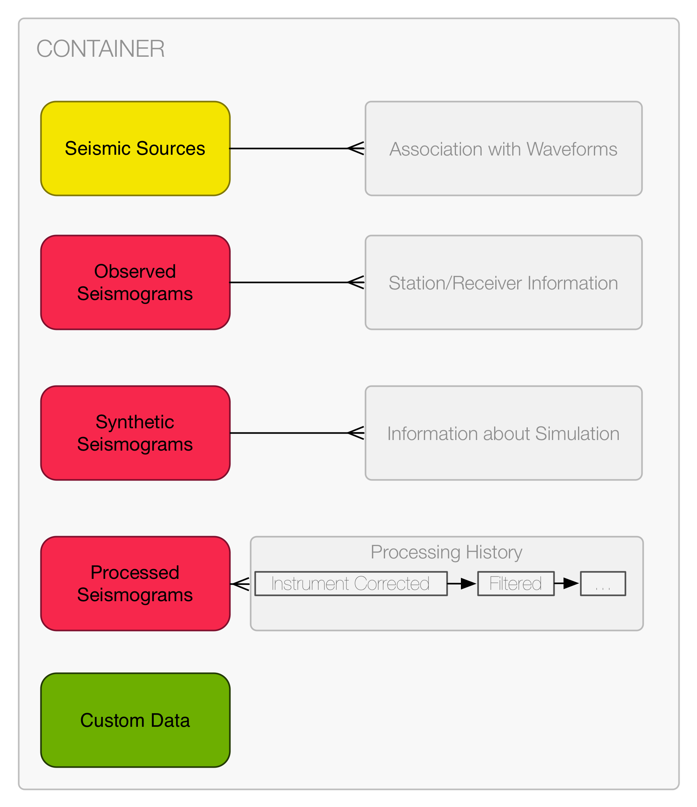

Introduction
============

Why introduce a new seismic data format?
----------------------------------------

1. The amount of seismic data available for analysis worldwide is rapidly
   growing. Seismic arrays, such as USArray and ChinaArray, give access to huge
   datasets that are not suited for older data formats. Industry datasets are
   likewise growing in size. 3D marine surveys can have 5000 shots and 50000
   recorders. This creates datasets on the petabyte scale and processing this
   data is often limited by archaic file structures. It is time to introduce a
   new seismic data format that is capable of handling these larger datasets.

2. Modern workflows in seismology take advantage of supercomputing resources
   and the number of files is an I/O bottleneck. The performance of these
   workflows on supercomputers would be increased if the data was stored by
   combining all time series for a single shot or earthquake into one file and
   taking advantage of parallel processing capabilities.

3. New methods, such as ambient-noise seismology, are limited by the fixed
   structure of older data formats that were meant for specific applications
   and for much more limited computing power. In addition, seismologists often
   ignore standards because adherence increases development time. An adaptable
   seismic data format with an open, modular design will be able to evolve and
   handle future advances in seismology.

4. Reproducibility is always a goal in science and seismology has yet to
   develop a standardized way of storing provenance in any of the current
   seismic data formats. Instead of limiting data exchange by using in-house
   formats it is time for an open-format that contains flexible provenance that
   lets the user know where the data comes from and what has been done to it.

5. By taking advantage of open-source software and the internet, the
   development of a modern seismic data format can be done in a cooperative
   manner with input from seismologists across different research areas. This
   will also allow a modular data format to evolve and adapt to problems in the
   future. An open wiki for development that allows for contributions from the
   community will help grow seismology as a science.

The container
-------------

There are several containers that are suitable for storing file content. Since
each container has potential advantages and shortcomings, the authors chose to
develop the format using two different containers and let users choose the one
that best suits their purpose. For example, if high performance parallel read
and write support is the primary goal, ADIOS may end up being a better
container for  applications. An advantage of both of these containers is that
they are self-describing , so that extra tests to check for a files endianness
will not be necessary.

* `ADIOS <https://www.olcf.ornl.gov/center-projects/adios/>`_

   * The Adaptable I/O system provides a simple and flexible way for scientists
     to describe the data in their code. ADIOS was chosen because it has shown
     superior scalability in certain simulations. The host code (either Fortran
     or C) can change how the data is processed without having to recompile the
     code. Buffering and scheduling is also used so that high performance I/O
     is attained on HPC systems.

* `HDF5 <http://www.hdfgroup.org/>`_

   * The Hierarchical Data Format is a quasi standard format for binary data
     with a large amount of tools and support available. This format has also
     shown promise for dealing with large datasets in other applications.

The user should not be concerned about which of the underlying containers are
used unless it is demonstrated that one is clearly superior for an application
of interest. In other words, there will be readers, writers, converters, and
processing software for the format that hides the details of which container
is ultimately used inside the file.

The container stores three fundamental categories of information: data,
metadata, and provenance. These terms are defined below.

**Data** - The source and the waveforms.

**Metadata** - Attributes for a piece of waveform data.

**Provenance** - A description of how a piece of waveform data was generated.

The container layout
--------------------

The container layout is meant to be adaptable to seismic data used in multiple
applications. To get a better idea of what this means, let's consider two
different applications of the seismic data.

The first example is from earthquake seismology. Since workflows in earthquake
seismology generally work on more than one waveform per event, it makes sense
to keep all waveforms associated with a single event together. The way the
format does this is illustrated below:

.. code-block:: python

    - Source (Optional)
    - Waveforms/
        |- NET.STA/
        |   |- StationXML (optional but recommended)
        |   |- NET.STA.LOC.CHAN_STARTTIME_ENDTIME[_TAG]/
        |   |    |- Provenance (optional, can be a reference)
        |   |    |- EventID (optional)
        |   |    |- OriginID (optional)
        |   |    |- MagnitudeID (optional)
        |   |    |- FocalMechanismID (optional)
        |   |    |- Data (Array)
        |   |    |   |- Starttime (Attribute)
        |   |    |   |- Sample Spacing (Attribute)
        |   |- NET.STA.LOC.CHAN_STARTTIME_ENDTIME[_TAG]/
        |   |    |- Provenance (optional, can be a reference)
        |   |    |- EventID (optional)
        |   |    |- OriginID (optional)
        |   |    |- MagnitudeID (optional)
        |   |    |- FocalMechanismID (optional)
        |   |    |- Data (Array)
        |   |    |   |- Starttime (Attribute)
        |   |    |   |- Sample Spacing (Attribute)
        |   |- ...
        |- ...
    - Provenances/ (optional)
        |- ...

* **"Source"** - The `QuakeML <https://quake.ethz.ch/quakeml/>`_ standard
  describes the earthquake and a sample file can be viewed
  `here <http://www.iris.edu/spudservice/momenttensor/999300/quakeml>`_.

* **"Waveforms"** - The waveform data will reside in the *Waveforms* folder
  further sorted per stations. This per-station sorting allows a natural use of
  the StationXML format to describe all receivers of a single station. Each
  station folder contains an arbitrary list of continuous waveform traces
  identifiable via the locations and channel attributes and the start- and
  endtime. A waveform is defined as a continuous trace without any gaps or
  overlaps. This implies that the time of the first sample and the sample
  spacing are enough to uniquely determine the time of every sample. The start-
  and endtimes for the folder name of the traces are to be specified as UTC
  times as `ISO 8601 <http://www.w3.org/TR/NOTE-datetime>`_ datetime strings with
  4 digit year representations. Most programming languages have built-in
  parsing routines for these strings. Note that the times here are just used
  for a quick overview and sorting purposes. The high-precision time stored as
  an attribute to the data array is the actually valid time.

* **NET, STA, LOC, CHAN** are placeholders for the network, station, location,
  and channel codes as defined in the
  `SEED Manual <http://www.fdsn.org/seed_manual/SEEDManual_V2.4.pdf>`_. They
  therefore follow the same limitations regarding the allowed characters
  (alphanumeric ASCII strings) and the length (network: 2, station: 5,
  location: 2, channel: 3). The `_TAG` part of the name is used to
  differentiate traces with exactly the same channel and duration, e.g.
  multiple synthetics from different
  simulations.

* **"StationXML"** - The `FDSN StationXML <http://www.fdsn.org/xml/station/>`_
  format describes the recording instrument for each piece of waveform data. An
  advantage of this format is its flexibility, meaning the instrument response
  can be stored for the observed waveform but not for the synthetic waveform.
  It also allows for non-seismic data, such as GPS and pressure data, to be
  included. An sample StationXML for station AFI can be viewed
  `here <http://service.iris.edu/fdsnws/station/1/query?net=IU&sta=AFI&loc=00&cha=LH?,BH*&starttime=2011-06-07T01:00:00&endtime=2011-06-07T07:00:00&level=station&format=xml&nodata=404>`_.

* **Provenance** - This is where information about the history of the data is
  kept. All data processing operations included in the SAC library are
  included. Furthermore all possible operations available in the ObsPy program
  are included. The inclusion of these two sets enables the description of most
  common workflows in seismology within the container layout. They form a
  processing chain than can optionally be defined for each trace, containing
  processing elements. The goal for the core format specification is to include
  a set of generally accepted processing elements that the community can agree
  on. The need for describing and keeping track of custom processing not
  captured by the core processing elements set is acknowledged with the ability
  to create new processing elements. Furthermore a free-form processing element
  will be supplied able to contain arbitrary information. See
  `Provenance <https://github.com/krischer/ASDF/wiki/Provenance-Definition>`_
  for more information.

Diagram
^^^^^^^

This simple diagrams aims to illustrate the main structure. Arrows denote links
either via ids or "symlinks". The diagram denotes the contents of the
container.

.. image:: https://raw.github.com/wiki/krischer/asdf/images/sdf.png
    :width: 100%
    :align: center

The second example is from seismic interferometry. In this case, we do not need
to store seismic source characteristics and organize a layout based on
cross-correlating long pairs of signals recorded from seismic stations.

.. code-block:: python

    - Station Pair/
        |- NET.STA/
        |   |- StationXML (optional but recommended)
        |   |- NET.STA.LOC.CHAN_STARTTIME_ENDTIME[_TAG]/
        |   |    |- Provenance (optional, can be a reference)
        |   |    |- Data (Array)
        |   |    |   |- Starttime (Attribute)
        |   |    |   |- Sample Spacing (Attribute)
        |- NET.STA/
        |   |- StationXML (optional but recommended)
        |   |- NET.STA.LOC.CHAN_STARTTIME_ENDTIME[_TAG]/
        |   |    |- Provenance (optional, can be a reference)
        |   |    |- Data (Array)
        |   |    |   |- Starttime (Attribute)
        |   |    |   |- Sample Spacing (Attribute)
        |- Cross Correlation
    - Provenances/ (optional)
        |- ...
