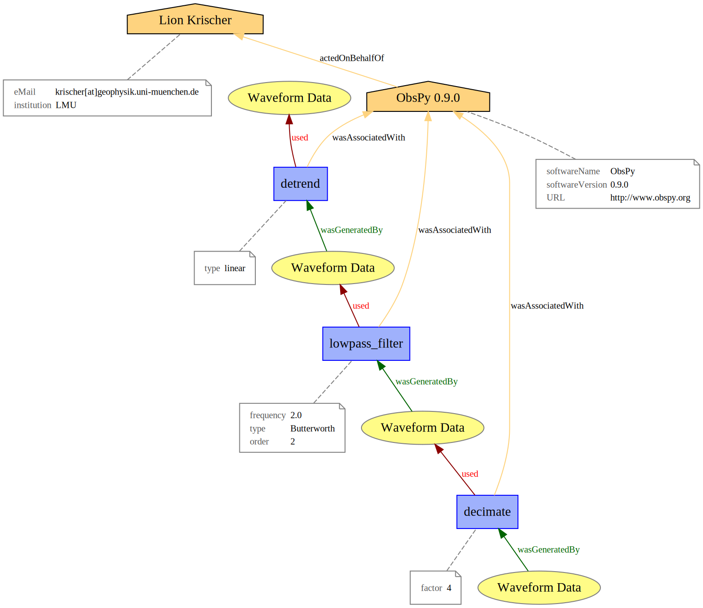
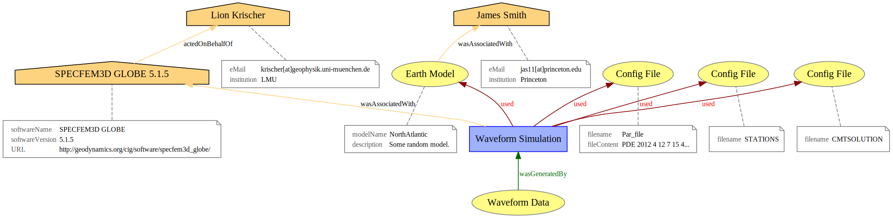

Provenance for Seismological Data
=================================

Introduction
------------

What is Provenance?
^^^^^^^^^^^^^^^^^^^

    Provenance is information about entities, activities, and people involved
    in producing a piece of data or thing, which can be used to form
    assessments about its quality, reliability or trustworthiness.
    [W3C_PROV]_

In a seismological context provenance can be seen as information about the
processes that created a particular piece of data. For synthetic waveforms the
provenance information describes which solver and settings therein were used to
generate it. When looking at processed seismograms the provenance has knowledge
about the different time series analysis steps that led to it.

Provenance information can be derived from different perspectives.
*Agent-centered provenance* describes what people where involved in the
creation of a particular piece of data. *Object-centered provenance* traces the
origins of data by tracking the different pieces of information that assembled
it.  *Process-centered provenance* finally captures the actions that were taken
to generate that particular piece of data.

For the following we will take the **process-centered** viewpoint as
essentially all data in seismology can be described by a succession of
different processes that created it.

Provenance is a kind of metainformation but there is metainformation that is
not considered to be provenance. For example the physical location of a seismic
data recording is metadata but not provenance.

Why it matters
^^^^^^^^^^^^^^

Provenance is a key step towards the goal of fully reproducible research. The
final result of many research projects are some papers describing methodology
and results. Due to many subjective choices greatly influencing the final
result many papers are essentially one off studies that cannot be reproduced.
Scientists need to be very disciplined if they aim for reproducible results.
This problem only intensifies with increasing amounts of data common in modern
research.

Provenance is in theory able to solve this by capturing all information that
went into producing a particular result.

Goal of the Seismological Provenance Description
^^^^^^^^^^^^^^^^^^^^^^^^^^^^^^^^^^^^^^^^^^^^^^^^

We here do not aim for full reproducibility as too many variables affect the
final result. Effects we do not aim to capture are for example floating point
math difference on different machines and compilers, errors in CPU operations,
and the similar hard to describe effects.

**Somebody looking at data described by our provenance information should be
able to tell what steps where taken to generate this particular piece of data
in a qualitative fashion.**

SEIS PROV
---------

.. danger::
    This is work in progress and in no way finalized yet. Its main purpose
    right now is to spark some discussion.

`W3C PROV <http://www.w3.org/TR/2013/NOTE-prov-overview-20130430/>`_ describes
a generic data model for provenance. It defines a number of different
serializations for this information. As SDF already contains QuakeML and
StationXML it just makes sense to use the XML representation known as
`PROV-XML <http://www.w3.org/TR/prov-xml>`_ within SDF.

*SEIS PROV* is the working name of a domain specific extension for using
*W3C PROV* in the context of seismological data processing and generation.

This section aims to give a short introduction to *SEIS PROV* and *W3C PROV*
with a focus on the XML and graphical representations. We will use examples
familiar to seismologists where appropriate. The XML representation is fairly
verbose and tool support will be vital for its success.

SEIS PROV Namespace
^^^^^^^^^^^^^^^^^^^

The namespace for SEIS PROV extension is *http://sdf.readthedocs.org* which
**will change** at some point. In this document we will use the **seis_prov**
prefix to refer to it.

Nodes
^^^^^

*W3C PROV* in essence describes a graph consisting of different types of nodes,
which are connected by different types of edges. There are three types of nodes
in *W3C PROV*. We will introduce each with a short description, a plot, and an
XML example.

Entity
______

.. sidebar:: Entity Plot

    .. image:: ./images/waveform_entity.svg

    Entities are depicted as yellow ellipses.

An entity is an actual thing with some fixed aspects. In a seismological
context an entity is usually some piece of waveform or other data for which
provenance is described. In a time series analysis workflow for example the
data after each step in the processing chain will be described by an entity.

*SEIS PROV* defines the *waveformDataEntity*, an entity representing waveform
data. It is a straight extension from the default entity, in terms of an XSD
scheme it looks like the following.

.. code-block:: xml

    <xs:complexType name="seis_prov:waveformDataEntity">
      <xs:complexContent>
        <xs:extension base="prov:entity">
        </xs:extension>
      </xs:complexContent>
    </xs:complexType>

An actual example XML which just contains a single *waveformDataEntity* looks
like the following.

.. code-block:: xml

    <?xml version='1.0' encoding='UTF-8'?>
    <prov:document xmlns:prov="http://www.w3.org/ns/prov#" xmlns:seis_prov="http://sdf.readthedocs.org">
      <seis_prov:waveformDataEntity prov:id="waveform_data_b845bab2-e745-449b-8a9e-e195a126039d">
        <prov:label>Waveform Data</prov:label>
      </seis_prov:waveformDataEntity>
    </prov:document>

Activity
________

.. sidebar:: Activity Plot

    .. image:: ./images/activity.svg

    Activities are blue rectangles.

Activities are action that can change or generate entities. In seismological
data processing, each processing step can be seen as an activity that uses the
data and generates a new version of the data.

A further example for an activity would be a simulation run which generates
some synthetic waveforms. Also an event relocation could be considered an
activity but that can also be stored in the QuakeML file directly, thus an
identifier which event was actually used should be enough.

Model generation can be considered an activity, as can adjoint backwards
simulations to generate gradients. We should discuss whether we want to define
each activity or if we just define a general activity and then let the users
specify the details in the activities description.

Activities can either use existing entities and generate new ones.

A PROV XML example for an activity representing a linear detrending operation
on some piece of waveform data is given in the following.

.. code-block:: xml

    <?xml version='1.0' encoding='UTF-8'?>
    <prov:document xmlns:prov="http://www.w3.org/ns/prov#" xmlns:seis_prov="http://sdf.readthedocs.org">
      <seis_prov:seismicProcessing prov:id="seismic_processing_detrend_c9b68e0b-7d0b-4967-babf-03e17b7a13bf">
        <prov:label>detrend</prov:label>
        <seis_prov:type>linear</seis_prov:type>
      </seis_prov:seismicProcessing>
    </prov:document>

Agent
_____

.. sidebar:: Agent Plot

    .. image:: ./images/obspy_agent.svg

    Agents are orange houses.

Agents are persons, organizations, or software programs responsible for some
activity, entity, or another agent. One can define different relations between
the nodes. A classical example for an agent would be which software performed
the processing and which person steered the software. It could also be a group
of people or an institution.

PROV DM already defines a software agent so we just need to define some
additional fields we always want present within a software agent. Examples for
this are the sofware name, the version, and the URL where to get the software.
The following is an example of a software agent within SEIS PROV.

.. code-block:: xml

    <?xml version='1.0' encoding='UTF-8'?>
    <prov:document xmlns:prov="http://www.w3.org/ns/prov#" xmlns:seis_prov="http://sdf.readthedocs.org">
      <prov:softwareAgent prov:id="obspy_0.9.0_4df22acf-4ba3-411f-8666-efcc42c7dc87">
        <prov:label>ObsPy 0.9.0</prov:label>
        <seis_prov:softwareName>ObsPy</seis_prov:softwareName>
        <seis_prov:softwareVersion>0.9.0</seis_prov:softwareVersion>
        <seis_prov:URL>http://www.obspy.org</seis_prov:URL>
      </prov:softwareAgent>
    </prov:document>

Examples
^^^^^^^^

This section shows some more extensive examples. Keep in mind that these
diagrams describe the history of some piece of data, not a workflow.  The
**arrows point towards the past**, e.g. to the origin of the data.

.. note::
    `Right click -> View Image` to see graphs in more detail.

Processing Chain
________________

This example demonstrates how a simple chain of signal processing routines
might be described.  The data has been detrended with a linear fit, then a
Butterworth lowpass filter has been applied and finally some integer decimation
has been performed. All of these operations where performed by a certain
version of ObsPy, controlled by a person.

The corresponding XML representation.

.. code-block:: xml

    <?xml version='1.0' encoding='UTF-8'?>
    <prov:document xmlns:prov="http://www.w3.org/ns/prov#" xmlns:seis_prov="http://sdf.readthedocs.org">
      <prov:person prov:id="lion_krischer_cdcecaf2-eff6-4fb9-a53e-39eb5c100bc2">
        <prov:label>Lion Krischer</prov:label>
        <seis_prov:eMail>krischer[at]geophysik.uni-muenchen.de</seis_prov:eMail>
        <seis_prov:institution>LMU</seis_prov:institution>
      </prov:person>
      <prov:softwareAgent prov:id="obspy_0.9.0_8355e390-0d9d-4bd9-aa1b-0fc8d6315caa">
        <prov:label>ObsPy 0.9.0</prov:label>
        <seis_prov:softwareName>ObsPy</seis_prov:softwareName>
        <seis_prov:softwareVersion>0.9.0</seis_prov:softwareVersion>
        <seis_prov:URL>http://www.obspy.org</seis_prov:URL>
      </prov:softwareAgent>
      <seis_prov:waveformDataEntity prov:id="waveform_data_f93d2570-3496-4c64-a98d-b77428945fe5">
        <prov:label>Waveform Data</prov:label>
      </seis_prov:waveformDataEntity>
      <seis_prov:seismicProcessing prov:id="seismic_processing_detrend_97bbe96d-e8aa-4f82-b1bb-6e6399dfdfab">
        <prov:label>detrend</prov:label>
        <seis_prov:type>linear</seis_prov:type>
      </seis_prov:seismicProcessing>
      <seis_prov:waveformDataEntity prov:id="waveform_data_38bc6bbb-f78c-43c9-a7be-fa5db86a214b">
        <prov:label>Waveform Data</prov:label>
      </seis_prov:waveformDataEntity>
      <seis_prov:seismicProcessing prov:id="seismic_processing_lowpass_filter_0930f00d-b2f2-4f95-9e28-7e63bd773579">
        <prov:label>lowpass_filter</prov:label>
        <seis_prov:frequency>2.0</seis_prov:frequency>
        <seis_prov:type>Butterworth</seis_prov:type>
        <seis_prov:order>2</seis_prov:order>
      </seis_prov:seismicProcessing>
      <seis_prov:waveformDataEntity prov:id="waveform_data_062c9190-1a19-4706-99ee-9a5db26f1020">
        <prov:label>Waveform Data</prov:label>
      </seis_prov:waveformDataEntity>
      <seis_prov:seismicProcessing prov:id="seismic_processing_decimate_a2f3cb5e-cfdc-4367-bd55-c99001d6ca9e">
        <prov:label>decimate</prov:label>
        <seis_prov:factor>4</seis_prov:factor>
      </seis_prov:seismicProcessing>
      <seis_prov:waveformDataEntity prov:id="waveform_data_115da730-d991-4531-b333-fafe5c45f74b">
        <prov:label>Waveform Data</prov:label>
      </seis_prov:waveformDataEntity>
      <prov:actedOnBehalfOf>
        <prov:softwareAgent prov:ref="obspy_0.9.0_8355e390-0d9d-4bd9-aa1b-0fc8d6315caa"/>
        <prov:person prov:ref="lion_krischer_cdcecaf2-eff6-4fb9-a53e-39eb5c100bc2"/>
      </prov:actedOnBehalfOf>
      <prov:wasAssociatedWith>
        <seis_prov:seismicProcessing prov:ref="seismic_processing_detrend_97bbe96d-e8aa-4f82-b1bb-6e6399dfdfab"/>
        <prov:softwareAgent prov:ref="obspy_0.9.0_8355e390-0d9d-4bd9-aa1b-0fc8d6315caa"/>
      </prov:wasAssociatedWith>
      <prov:used>
        <seis_prov:seismicProcessing prov:ref="seismic_processing_detrend_97bbe96d-e8aa-4f82-b1bb-6e6399dfdfab"/>
        <seis_prov:waveformDataEntity prov:ref="waveform_data_f93d2570-3496-4c64-a98d-b77428945fe5"/>
      </prov:used>
      <prov:wasGeneratedBy>
        <seis_prov:waveformDataEntity prov:ref="waveform_data_38bc6bbb-f78c-43c9-a7be-fa5db86a214b"/>
        <seis_prov:seismicProcessing prov:ref="seismic_processing_detrend_97bbe96d-e8aa-4f82-b1bb-6e6399dfdfab"/>
      </prov:wasGeneratedBy>
      <prov:wasAssociatedWith>
        <seis_prov:seismicProcessing prov:ref="seismic_processing_lowpass_filter_0930f00d-b2f2-4f95-9e28-7e63bd773579"/>
        <prov:softwareAgent prov:ref="obspy_0.9.0_8355e390-0d9d-4bd9-aa1b-0fc8d6315caa"/>
      </prov:wasAssociatedWith>
      <prov:used>
        <seis_prov:seismicProcessing prov:ref="seismic_processing_lowpass_filter_0930f00d-b2f2-4f95-9e28-7e63bd773579"/>
        <seis_prov:waveformDataEntity prov:ref="waveform_data_38bc6bbb-f78c-43c9-a7be-fa5db86a214b"/>
      </prov:used>
      <prov:wasGeneratedBy>
        <seis_prov:waveformDataEntity prov:ref="waveform_data_062c9190-1a19-4706-99ee-9a5db26f1020"/>
        <seis_prov:seismicProcessing prov:ref="seismic_processing_lowpass_filter_0930f00d-b2f2-4f95-9e28-7e63bd773579"/>
      </prov:wasGeneratedBy>
      <prov:wasAssociatedWith>
        <seis_prov:seismicProcessing prov:ref="seismic_processing_decimate_a2f3cb5e-cfdc-4367-bd55-c99001d6ca9e"/>
        <prov:softwareAgent prov:ref="obspy_0.9.0_8355e390-0d9d-4bd9-aa1b-0fc8d6315caa"/>
      </prov:wasAssociatedWith>
      <prov:used>
        <seis_prov:seismicProcessing prov:ref="seismic_processing_decimate_a2f3cb5e-cfdc-4367-bd55-c99001d6ca9e"/>
        <seis_prov:waveformDataEntity prov:ref="waveform_data_062c9190-1a19-4706-99ee-9a5db26f1020"/>
      </prov:used>
      <prov:wasGeneratedBy>
        <seis_prov:waveformDataEntity prov:ref="waveform_data_115da730-d991-4531-b333-fafe5c45f74b"/>
        <seis_prov:seismicProcessing prov:ref="seismic_processing_decimate_a2f3cb5e-cfdc-4367-bd55-c99001d6ca9e"/>
      </prov:wasGeneratedBy>
    </prov:document>

Waveform Simulation
___________________

This example demonstrates the first steps towards storing provenance for a
waveform simulation run. Some things still need to be figured out. The most
pressing need would be to store the input files for the solvers. It would be
possible to store them directly in the XML which should prove no issue.

.. code-block:: xml

    <?xml version='1.0' encoding='UTF-8'?>
    <prov:document xmlns:prov="http://www.w3.org/ns/prov#" xmlns:seis_prov="http://sdf.readthedocs.org">
      <prov:person prov:id="lion_krischer_e11660a9-4a58-445c-8abb-90d7fc4e74db">
        <prov:label>Lion Krischer</prov:label>
        <seis_prov:eMail>krischer[at]geophysik.uni-muenchen.de</seis_prov:eMail>
        <seis_prov:institution>LMU</seis_prov:institution>
      </prov:person>
      <prov:person prov:id="james_smith_a7606f3a-e9da-4ce2-ae9b-8f702c5a8db7">
        <prov:label>James Smith</prov:label>
        <seis_prov:eMail>jas11[at]princeton.edu</seis_prov:eMail>
        <seis_prov:institution>Princeton</seis_prov:institution>
      </prov:person>
      <prov:softwareAgent prov:id="specfem3d_globe_5.1.5_c2865c2f-09ab-4608-aa54-ed33f6b748d1">
        <prov:label>SPECFEM3D GLOBE 5.1.5</prov:label>
        <seis_prov:softwareName>SPECFEM3D GLOBE</seis_prov:softwareName>
        <seis_prov:softwareVersion>5.1.5</seis_prov:softwareVersion>
        <seis_prov:URL>http://geodynamics.org/cig/software/specfem3d_globe/</seis_prov:URL>
      </prov:softwareAgent>
      <seis_prov:waveformDataEntity prov:id="waveform_data_244ef893-d253-44ec-a4c1-c36ecc42db6d">
        <prov:label>Waveform Data</prov:label>
      </seis_prov:waveformDataEntity>
      <seis_prov:seismicProcessing prov:id="seismic_processing_waveform_simulation_4fd26b5c-149d-4947-afe1-8aebe97e6233">
        <prov:label>Waveform Simulation</prov:label>
      </seis_prov:seismicProcessing>
      <seis_prov:earthModel prov:id="earth_model_NorthAtlantic_a2c82848-cb2b-469d-b717-65948e11ae49">
        <prov:label>Earth Model</prov:label>
        <seis_prov:modelName>NorthAtlantic</seis_prov:modelName>
        <seis_prov:description>Some random model.</seis_prov:description>
      </seis_prov:earthModel>
      <seis_prov:configFile prov:id="config_file_a5c505a9-21e9-4fbb-9e8d-a840d49b062e">
        <prov:label>Config File</prov:label>
        <seis_prov:filename>Par_file</seis_prov:filename>
        <seis_prov:fileContent>PDE 2012 4 12 7 15 4...</seis_prov:fileContent>
      </seis_prov:configFile>
      <seis_prov:configFile prov:id="config_file_667bb515-49ee-4c54-834a-d5c27b0f26f6">
        <prov:label>Config File</prov:label>
        <seis_prov:filename>CMTSOLUTION</seis_prov:filename>
      </seis_prov:configFile>
      <seis_prov:configFile prov:id="config_file_28048f35-e117-4b7c-93c4-b325e7514e0c">
        <prov:label>Config File</prov:label>
        <seis_prov:filename>STATIONS</seis_prov:filename>
      </seis_prov:configFile>
      <prov:actedOnBehalfOf>
        <prov:softwareAgent prov:ref="specfem3d_globe_5.1.5_c2865c2f-09ab-4608-aa54-ed33f6b748d1"/>
        <prov:person prov:ref="lion_krischer_e11660a9-4a58-445c-8abb-90d7fc4e74db"/>
      </prov:actedOnBehalfOf>
      <prov:used>
        <seis_prov:seismicProcessing prov:ref="seismic_processing_waveform_simulation_4fd26b5c-149d-4947-afe1-8aebe97e6233"/>
        <seis_prov:configFile prov:ref="config_file_a5c505a9-21e9-4fbb-9e8d-a840d49b062e"/>
      </prov:used>
      <prov:used>
        <seis_prov:seismicProcessing prov:ref="seismic_processing_waveform_simulation_4fd26b5c-149d-4947-afe1-8aebe97e6233"/>
        <seis_prov:configFile prov:ref="config_file_667bb515-49ee-4c54-834a-d5c27b0f26f6"/>
      </prov:used>
      <prov:used>
        <seis_prov:seismicProcessing prov:ref="seismic_processing_waveform_simulation_4fd26b5c-149d-4947-afe1-8aebe97e6233"/>
        <seis_prov:configFile prov:ref="config_file_28048f35-e117-4b7c-93c4-b325e7514e0c"/>
      </prov:used>
      <prov:wasAssociatedWith>
        <seis_prov:earthModel prov:ref="earth_model_NorthAtlantic_a2c82848-cb2b-469d-b717-65948e11ae49"/>
        <prov:person prov:ref="james_smith_a7606f3a-e9da-4ce2-ae9b-8f702c5a8db7"/>
      </prov:wasAssociatedWith>
      <prov:used>
        <seis_prov:seismicProcessing prov:ref="seismic_processing_waveform_simulation_4fd26b5c-149d-4947-afe1-8aebe97e6233"/>
        <seis_prov:earthModel prov:ref="earth_model_NorthAtlantic_a2c82848-cb2b-469d-b717-65948e11ae49"/>
      </prov:used>
      <prov:wasGeneratedBy>
        <seis_prov:waveformDataEntity prov:ref="waveform_data_244ef893-d253-44ec-a4c1-c36ecc42db6d"/>
        <seis_prov:seismicProcessing prov:ref="seismic_processing_waveform_simulation_4fd26b5c-149d-4947-afe1-8aebe97e6233"/>
      </prov:wasGeneratedBy>
      <prov:wasAssociatedWith>
        <seis_prov:seismicProcessing prov:ref="seismic_processing_waveform_simulation_4fd26b5c-149d-4947-afe1-8aebe97e6233"/>
        <prov:softwareAgent prov:ref="specfem3d_globe_5.1.5_c2865c2f-09ab-4608-aa54-ed33f6b748d1"/>
      </prov:wasAssociatedWith>
    </prov:document>

.. [W3C_PROV] http://www.w3.org/TR/2013/NOTE-prov-overview-20130430/

