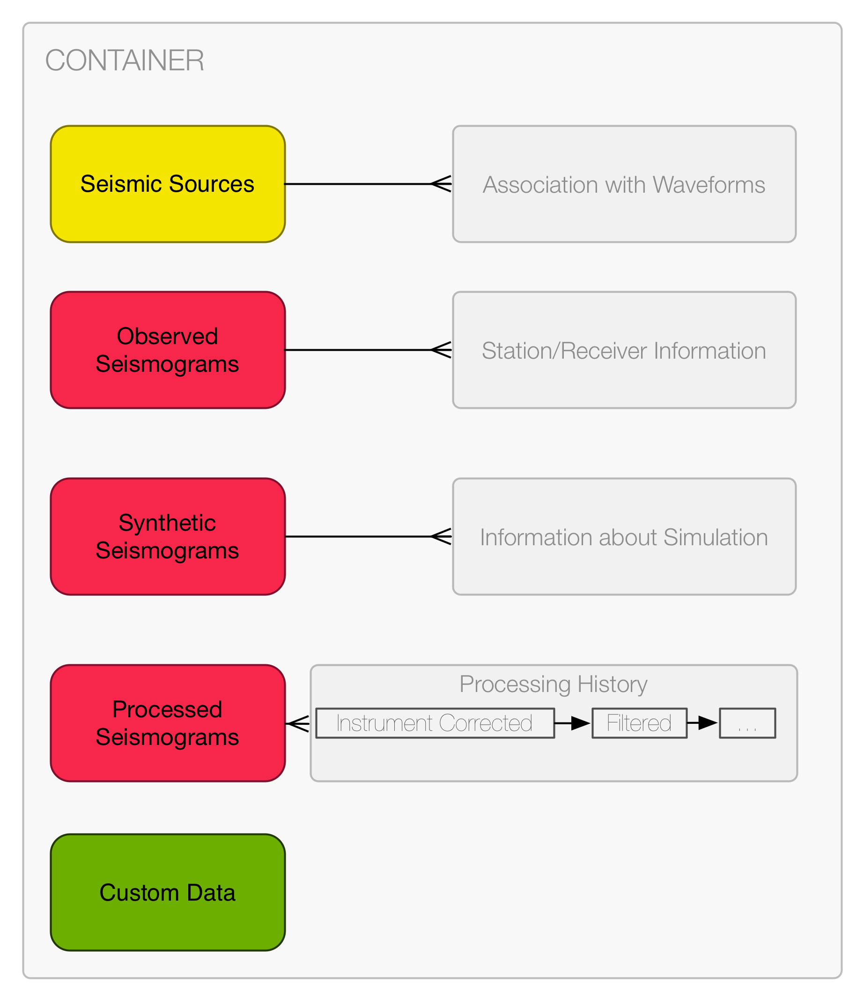

Waveform Data
=============

* **"Waveforms"** - The waveform data will reside in the *Waveforms* folder
  further sorted per stations. This per-station sorting allows a natural use of
  the StationXML format to describe all receivers of a single station. Each
  station folder contains an arbitrary list of continuous waveform traces
  identifiable via the locations and channel attributes and the start- and
  endtime. A waveform is defined as a continuous trace without any gaps or
  overlaps. This implies that the time of the first sample and the sample
  spacing are enough to uniquely determine the time of every sample. The start-
  and endtimes for the folder name of the traces are to be specified as UTC
  times as `ISO 8601 <http://www.w3.org/TR/NOTE-datetime>`_ datetime strings with
  4 digit year representations. Most programming languages have built-in
  parsing routines for these strings. Note that the times here are just used
  for a quick overview and sorting purposes. The high-precision time stored as
  an attribute to the data array is the actually valid time.
p
* **NET, STA, LOC, CHAN** are placeholders for the network, station, location,
  and channel codes as defined in the
  `SEED Manual <http://www.fdsn.org/seed_manual/SEEDManual_V2.4.pdf>`_. They
  therefore follow the same limitations regarding the allowed characters
  (alphanumeric ASCII strings) and the length (network: 2, station: 5,
  location: 2, channel: 3). The `_TAG` part of the name is used to
  differentiate traces with exactly the same channel and duration, e.g.
  multiple synthetics from different
  simulations.

* **"StationXML"** - The `FDSN StationXML <http://www.fdsn.org/xml/station/>`_
  format describes the recording instrument for each piece of waveform data. An
  advantage of this format is its flexibility, meaning the instrument response
  can be stored for the observed waveform but not for the synthetic waveform.
  It also allows for non-seismic data, such as GPS and pressure data, to be
  included. An sample StationXML for station AFI can be viewed
  `here <http://service.iris.edu/fdsnws/station/1/query?net=IU&sta=AFI&loc=00&cha=LH?,BH*&starttime=2011-06-07T01:00:00&endtime=2011-06-07T07:00:00&level=station&format=xml&nodata=404>`_.

SEED structure layout
---------------------

In this case the data is organized per station, each of which will have its own
folder. The metainformation for each station and receivers therein is described
in a StationXML file in the folder.

Metadata is available in one of the following forms.

Using the proven SEED channel ids and corresponding StationXML files for
example enables the storage of arbitrarily oriented components and the
identification of non-seismometer measurements like GPS or pressure data (we
should investigate if the GPS people actually use SEED, I know the SCEC serves
them as SAC and the actual raw GPS measurements are their own formats, but the
actual displacement could just as well be stored in a SEED file - then it would
also be suitable for ASDF).

The actual structure is defined as follows

.. code-block:: xml

    - QuakeML (optional)
    - Waveforms/
        |- NET.STA/
        |   |- StationXML (optional but recommended)
        |   |- NET.STA.LOC.CHAN_STARTTIME_ENDTIME[_TAG]/
        |   |    |- Provenance (optional, can be a reference)
        |   |    |- EventID (optional)
        |   |    |- OriginID (optional)
        |   |    |- MagnitudeID (optional)
        |   |    |- FocalMechanismID (optional)
        |   |    |- Data (Array)
        |   |    |   |- Starttime (Attribute)
        |   |    |   |- Sample Spacing (Attribute)
        |   |- NET.STA.LOC.CHAN_STARTTIME_ENDTIME[_TAG]/
        |   |    |- Provenance (optional, can be a reference)
        |   |    |- EventID (optional)
        |   |    |- OriginID (optional)
        |   |    |- MagnitudeID (optional)
        |   |    |- FocalMechanismID (optional)
        |   |    |- Data (Array)
        |   |    |   |- Starttime (Attribute)
        |   |    |   |- Sample Spacing (Attribute)
        |   |- ...
        |- ...
    - Provenances/ (optional)
        |- ...

The actual waveform data will reside in the *Waveforms* folder further sorted
per stations. This per-station sorting allows a natural use of the StationXML
format to describe all receivers of a single station.

Each station folder contains an arbitrary list of continuous waveform traces
identifiable via the locations and channel attributes and the start- and
endtime. ASDF defines a continuous trace as a single chunk of data without any
gaps or overlaps. This implies that the time of the first sample and the sample
spacing are enough to uniquely determine the time of every sample.

The container layout is meant to be adaptable to seismic data used in multiple
applications. To get a better idea of what this means, let's consider two
different applications of the seismic data.

The first example is from earthquake seismology. Since workflows in earthquake
seismology generally work on more than one waveform per event, it makes sense
to keep all waveforms associated with a single event together. The way the
format does this is illustrated below:

.. code-block:: python

    - Source (Optional)
    - Waveforms/
        |- NET.STA/
        |   |- StationXML (optional but recommended)
        |   |- NET.STA.LOC.CHAN_STARTTIME_ENDTIME[_TAG]/
        |   |    |- Provenance (optional, can be a reference)
        |   |    |- EventID (optional)
        |   |    |- OriginID (optional)
        |   |    |- MagnitudeID (optional)
        |   |    |- FocalMechanismID (optional)
        |   |    |- Data (Array)
        |   |    |   |- Starttime (Attribute)
        |   |    |   |- Sample Spacing (Attribute)
        |   |- NET.STA.LOC.CHAN_STARTTIME_ENDTIME[_TAG]/
        |   |    |- Provenance (optional, can be a reference)
        |   |    |- EventID (optional)
        |   |    |- OriginID (optional)
        |   |    |- MagnitudeID (optional)
        |   |    |- FocalMechanismID (optional)
        |   |    |- Data (Array)
        |   |    |   |- Starttime (Attribute)
        |   |    |   |- Sample Spacing (Attribute)
        |   |- ...
        |- ...
    - Provenances/ (optional)
        |- ...

Naming Details
--------------

**NET, STA, LOC, CHAN** are placeholders for the network, station, location,
and channel codes as defined in the [SEED
Manual](http://www.fdsn.org/seed_manual/SEEDManual_V2.4.pdf). They therefore
follow the same limitations regarding the allowed characters (alphanumeric
ASCII strings) and the length (network: 2, station: 5, location: 2, channel:
3).

The start- and endtimes for the folder name of the traces are to be specified
as UTC times as [ISO 8601](http://www.w3.org/TR/NOTE-datetime) datetime strings
with 4 digit year representations. Most programming languages have built-in
parsing routines for these strings. Note that the times here are just used for
a quick overview and sorting purposes. The high-precision time stored as an
attribute to the data array is the actually valid time.

The `_TAG` part of the name is used to differentiate traces with exactly the
same channel and duration, e.g. multiple synthetics from different simulations.
